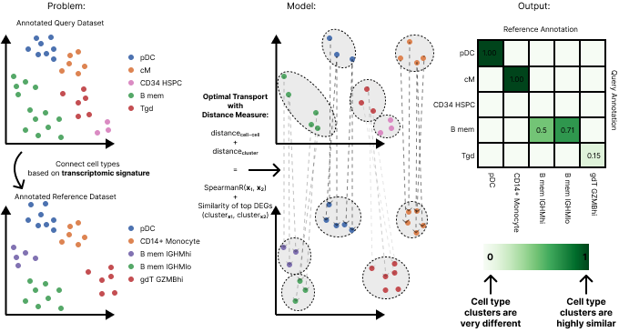
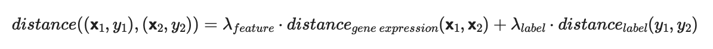
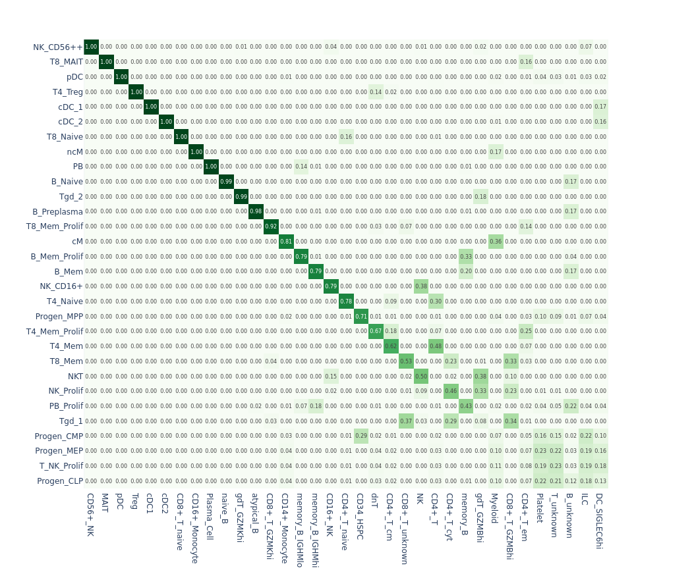
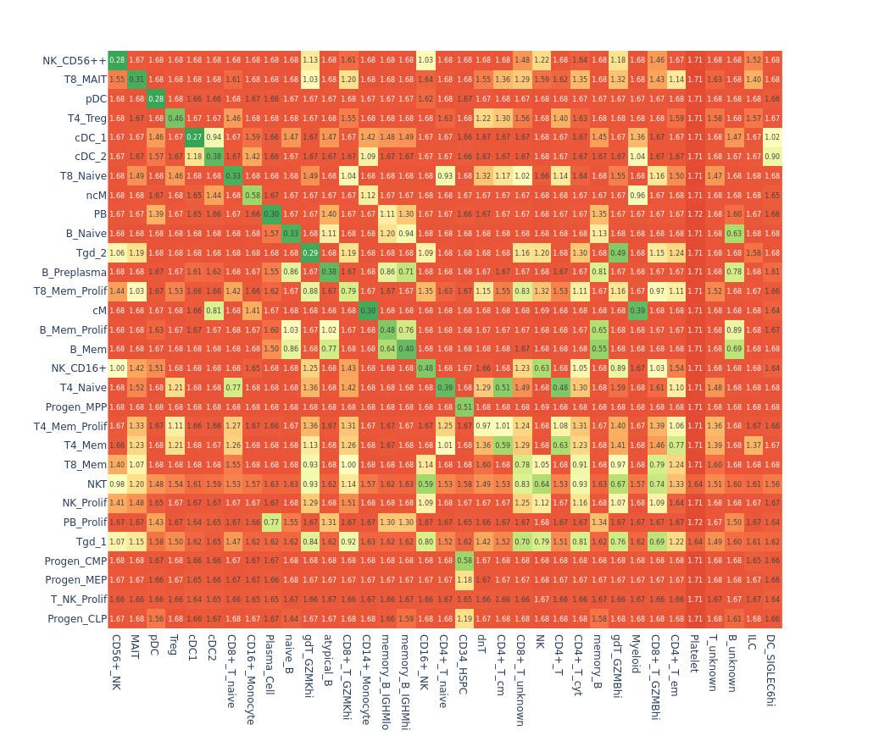

# SConnect

- [Introduction](#sconnect-identifying-the-similar-cell-types-and-cell-states-across-heterogeneous-studies)
- [Basics of using SConnect](#basics-of-using-sconnect)
- [Tutorial](#tutorial)
- [Installation](#installation)
  - [Running SConnect via Docker](#running-sconnect-via-docker)
  - [Manual installation](#install-sconnect-manually)
- [Project structure](#project-structure)
- [References](#references)

## SConnect: Identifying the similar cell types and cell states across heterogeneous studies.

* **What is SConnect?**
SConnect is a Python package to align cell annotations between single-cell RNA-seq datasets. Given the cell-type 
annotations of two datasets, SConnect shows the similarity of the respective cell type clusters. Hence, SConnect can be 
used to identify similar cell types and cell states between the two studies and to show to the user where there might be 
disagreements between cell annotations of the two datasets.


* **How does it work?** 
SConnect aims to “align” (or to “connect”) cell-type labels between two scRNA-seq datasets 
(query + reference dataset), suggesting similar clusters or potential matches against the reference dataset for each 
cell type in the query dataset solely based on the underlying transcriptomic signatures. To achieve this task, we model 
each dataset as a point cloud, meaning each data point or cell is associated with a gene expression vector (𝘅) and a 
cluster / cell-type label (y). Notably, the clustering or grouping information of individual cells uniformly annotated, 
not the associated string labels, is provided by the cell-type label y. At its core, SConnect uses optimal transport to 
connect the point cloud distribution of the query dataset with the point cloud from the reference dataset; thus, the 
method considers the global structure of the data, compared to just finding the closest neighbors in the reference dataset.  
The distance between a cell in the query dataset (described by the multi-dimensional gene expression vector 𝘅₁ and 
cluster label y₁) and a cell in the reference dataset (described by the multi-dimensional gene expression vector 
𝘅₂ and cluster label y₂) is split into two parts. The distance measure (also known as the “transport cost”) is the 
sum between the distance in gene expression space and the distance in label space:


* **What does it produce?**
SConnect produces two key outputs:

  * **Similarity Matrix**: Showing the closest matching (considering the global structure of the data) cell-type in the 
reference dataset for each cell-type in the query dataset.

  * **Distance Matrix**: Showing the similarity/distance between the cell-type clusters of the query and reference 
dataset.


* **What are the advantages over existing methods?** We improve over existing methods in two key ways:
  1. Using a considerably more predictive distance measure: By including information of differentially expressed genes 
in the distance measure we're able to resolve differences between fine-grained cell-type subtypes.
  2. Considering the global structure of the data: By using optimal transport we consider the global structure of the 
data and thus are able to provide more trustworthy suggestions.


## Basics of using SConnect

```python
import scanpy as sc

from datasim.preprocessing import preprocess_adatas

# 1. Preprocess input data
adata_query, adata_ref = preprocess_adatas(
    sc.read_h5ad("path/to/query.h5ad"),
    sc.read_h5ad("path/to/reference.h5ad"),
    n_top_genes=750,
    cell_type_column_adata1="cell_type_column_query",
    cell_type_column_adata2="cell_type_column_ref",
    sample_column_adata1="sequencing_sample_column_query",
    sample_column_adata2="sequencing_sample_column_ref",
)

# 2. Initialize SConnect model
from datasim.dataset_ot import DatasetMapping

dataset_map = DatasetMapping(adata_query, adata_ref)
dataset_map.init_geom(batch_size=512, epsilon=0.05)
dataset_map.init_problem(tau_a=1.0, tau_b=1.0)

# 3. Fit SConnect model
dataset_map.solve()
mapping = dataset_map.compute_cluster_mapping(aggregation_method="mean")
distance = dataset_map.compute_cluster_distances()

# 4. Visualize results
from datasim.plotting import plot_cluster_mapping, plot_cluster_distance

plot_cluster_mapping(mapping)  # similarity matrix
distance = distance.loc[
    mapping.max(axis=1).sort_values(ascending=False).index.tolist(),
    mapping.max().sort_values(ascending=False).index.tolist(),
]  # order cluster distance matrix the same way as similarity matrix
plot_cluster_distance(distance)  # cluster distance matrix
```


## Tutorial
Please see the following tutorials for detailed examples of how to use SConnect:

### SConnect: Detailed explanation
* [Jupyter Notebook](https://github.com/cellannotation/dataset-similarity/blob/devel/docs/SConnect_tutorial.ipynb)
* [HTML version](https://htmlpreview.github.io/?https://raw.githubusercontent.com/cellannotation/dataset-similarity/refs/heads/devel/docs/SConnect_tutorial.html?token=GHSAT0AAAAAAC454HSO6MWB4UXAHCVJR5IU2A2BR5A)

## Installation

### Running SConnect via Docker
To run SConnect, we provide a docker image that contains all the necessary dependencies: https://hub.docker.com/r/felix0097/sconnect/tags
```bash
docker pull felix0097/sconnect:v1
```

To run the R differential expression testing code (pre-processing), we provide a separate docker image: https://hub.docker.com/r/felix0097/pseudobulk/tags
```bash
docker pull felix0097/pseudobulk:v1
```

### Install SConnect manually

#### Python dependencies
Install via:
```bash
git clone git@github.com:cellannotation/dataset-similarity.git
cd dataset-similarity
pip install -e .
```

For more details to install ``jax``, see: https://docs.jax.dev/en/latest/installation.html

#### R dependencies (only need for pre-processing code)
1. Setup conda environment
    * ``conda create -n pseudobulk python==3.10``
    * Python 3.10 is important for the ``rpy2`` dependency to work correctly.
2. Install ``rpy2``
    * ``conda install rpy2==3.5.11``
    * ``rpy2`` version ``3.5.11`` uses ``R4.3`` which is need for all R dependencies.
    * If you use a different R version, you'll need to update the package versions of the R dependencies accordingly.
    * It's recommended to install ``rpy2`` via conda, as this already installs R on your system.
3. Install other python dependencies:
   * ``cython>=3.0.11``
   *  ``joblib>=1.4.2``
4. Install R dependencies
    * Open a `python` console and run the following commands:
    ```python
    import rpy2.robjects as ro
   
    INSTALL_R_PACKAGES = """
    if (!require("BiocManager", quietly = TRUE))
       install.packages("BiocManager")
    BiocManager::install("limma")
    
    install.packages("remotes")
    library(remotes)
    install_version("rhdf5", version = "2.46.1", repos = "https://bioconductor.org/packages/3.18/bioc")
    install_version("Matrix", version = "1.6-0")
    install_version("magrittr", version = "2.0.3")
    install_version("data.table", version = "1.15.4")
    install_version("glue", version = "1.7.0")
    install_version("stringr", version = "1.5.1")
    """
   
    ro.r(INSTALL_R_PACKAGES)
    ```
   * Important: You might have to install the ``binutils`` package on your system to install the above R packages. You 
   can do this by running the following command: ``sudo apt update && sudo apt install binutils``

### System requirements
Operating system: Ubuntu 22.04 LTS (used OS version)

Python version: 3.10 or higher


### Hardware requirements
To scale to atlas-scale datasets, we recommend:
* We recommend a modern GPU with at least 40GB of VRAM
* Moreover, for the pre-processing code, we recommend around 128GB of system memory (depending on dataset size)


## Project structure
* `datasim/`: Contains the code for the SConnect package and the differential expression testing code
* `docs/`: Contains the documentation and tutorial notebooks for SConnect
* `notebooks/`
  * `DEG-filtering/`: Code used to create gene list to filter differentially expressed genes.
  * `evaluation/`: Analysis code for paper
  * `example-data/`: Code used to download and preprocess the data used in the paper
  * `similarity-methods/`: `CellHint.ipynb` and `pyMN.ipynb` contains code to fit CellHint and MetaNeighbor reference models
* `scripts/`: Contains the scripts used to train SConnect


## Licence
MIT license


## References
`SConnect` was written by `Felix Fischer <felix.fischer@helmholtz-munich.de>`

Support for software development, testing, modeling, and benchmarking provided by the Cell Annotation Platform team 
(Roman Mukhin, Andrey Isaev, Uğur Bayındır)
